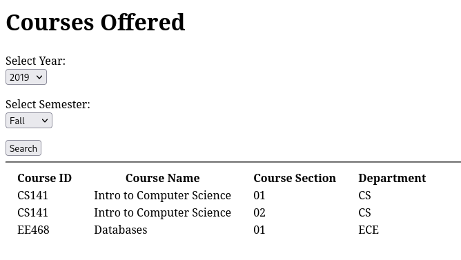

# *University Database Front-end*  
# User Manual
## Table of Contents
1. [General](#General)
1. [User Guide](#User-Guide)
	1. [Student](#Student)
	1. [Instructor](#Instructor)
	1. [Admin](#Admin)
1. [Troubleshooting](#Troubleshooting)
	1. [Invalid Login](Invalid-Login)

## General
Welcome to the *University Database Front-end* User Manual. Here you will find how to operate the front-end from the perspective of many different types of users such as *Admins,* *Instructors,* and *Students.* This front-end is designed to safely and securely give you access to our University's records with respect to your clearance and permission. Administrators will be given full access to all aspects of the database, while others can only view certain queries. You will also find troubleshooting for common misconceptions in the later parts of this manual.

## User Guide
As you access the front-end, the first thing you will be prompted with is the login screen. It appears as such:

The `Select User Type:` selection prompts you to enter which type *you,* the user, are.

The `ID #:` field is where you must enter your *Student ID* for the purpose of verification.

***If you fail to do either of these, or the `ID #` is invalid, you will be prompted to retry.***

### Student
Upon a successful login as a *Student,* you should be prompted with the following interface:

  

Here, you will be able to view which courses are offered in a given semester.

The first selection is the year of the specified semester.

The next selection is what season the semester falls under.

Finally, click the `Search` button to submit the query.

***If you fail to do any of these, you will be prompted to retry.***

### Instructor
Upon a successful login as an *Instructor,* you should be prompted with the following interface:

Here, you will be able to view one of two types of queries:

1. course section and number of students
1. list of students

The second selection is the year of the specified semester.

The third selection is what season the semester falls under.

Finally, click the `Search` button to submit the query.

***If you fail to do any of these, you will be prompted to retry.***

### Admin
## Troubleshooting
### Invalid Login
It is a common issue that the user will accidentally select the wrong [user type](#User-Guide) when logging in. Make sure that the `ID #` that you inputted corresponds to the type of user you have selected to be logged in as.